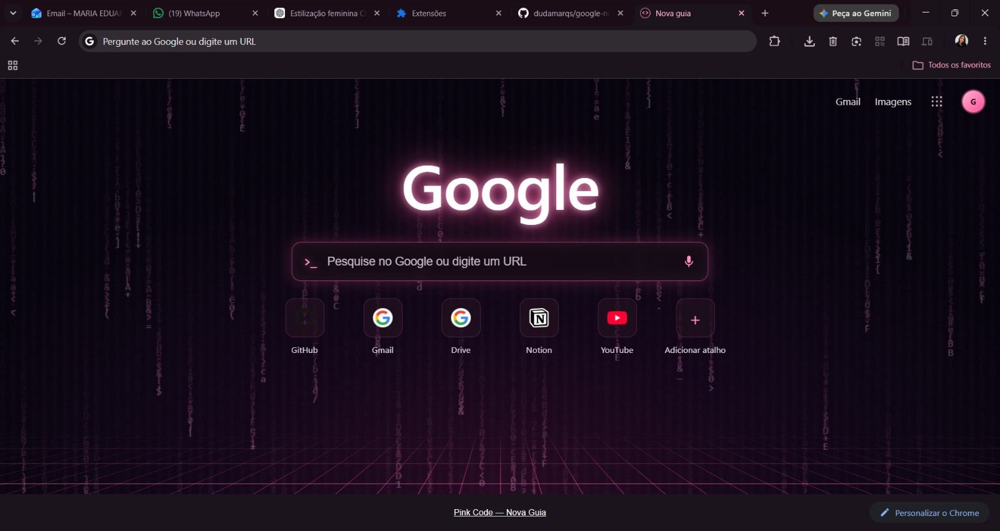
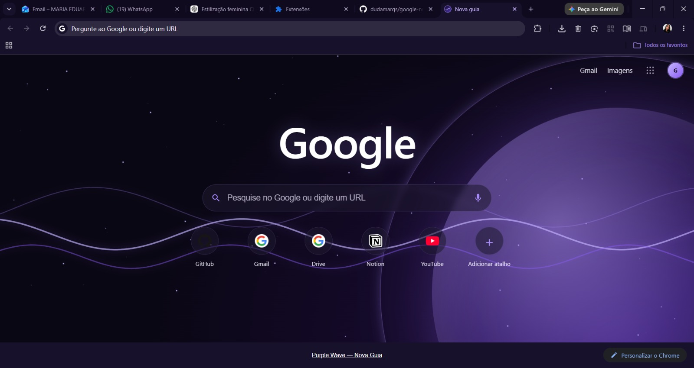
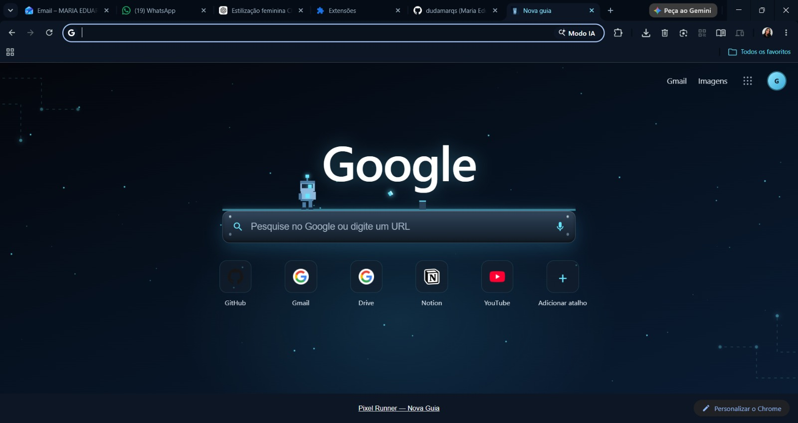
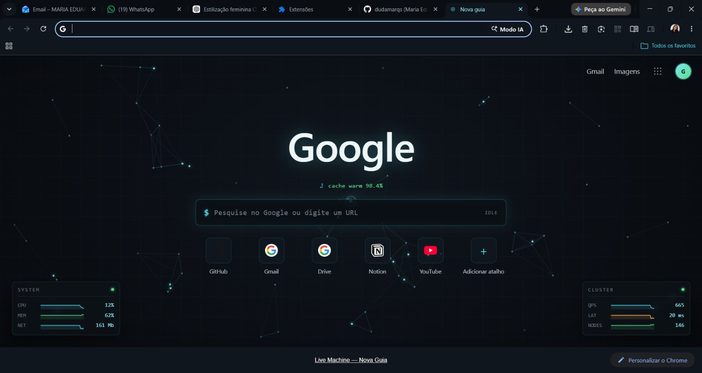
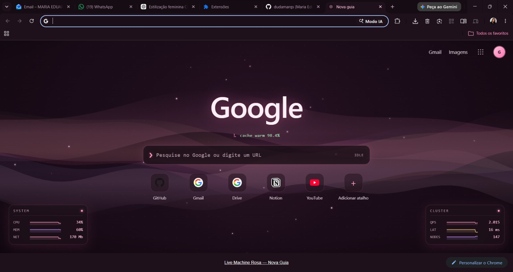

# 🌐 Dynamic New Tab — Temas dinâmicos para o Google Chrome

Pacote de **temas animados de "Nova Guia"** para o Google Chrome. Cada tema transforma a
página de nova aba em uma cena viva (com animações em `<canvas>`), estiliza a **página de
resultados do Google** e traz um **tema combinando para a UI do navegador** (abas, barra de
ferramentas, endereço e favoritos).

Tudo em HTML/CSS/JavaScript puro — **sem dependências, sem build, sem coleta de dados**.

🔗 **Site / galeria:** https://dudamarqs.github.io/google-newtab-themes/ · Desenvolvido por **Maria Eduarda Marques** ([@dudamarqs](https://github.com/dudamarqs))

---

## ✨ Os temas

| Tema | Estilo | Destaques |
|------|--------|-----------|
| **pink-code** | Synthwave rosa | Chuva de código, grade neon em perspectiva, busca neon |
| **purple-wave** | Dark roxo | Orbe luminoso + ondas em movimento lento |
| **pixel-runner** | Pixel art azul | Robô que corre sobre a barra de pesquisa, pula obstáculos, coleta cubos e sai de um portal |
| **live-machine** | Tech / datacenter | "Computador vivo": malha de dados até um núcleo, telemetria (CPU/QPS/latência) e terminal |
| **live-machine-rose** | Aurora feminina | Variação do Live Machine em fitas de aurora rosa/lavanda/dourado |

> A cada busca, os temas com "máquina" reagem — os dados convergem para o núcleo e as
> métricas disparam.

---

## 🖼️ Demonstração

### Pink Code


### Purple Wave


### Pixel Runner


### Live Machine


### Live Machine Rosa


---

## 📦 Estrutura

Cada tema tem **duas pastas**:

```
<tema>/            → a extensão (nova guia + estilo da busca do Google)
<tema>-theme/      → o tema da UI do Chrome (abas, toolbar, endereço, favoritos)
```

```
.
├── pink-code/           pink-code-theme/
├── purple-wave/         purple-wave-theme/
├── pixel-runner/        pixel-runner-theme/
├── live-machine/        live-machine-theme/
└── live-machine-rose/   live-machine-rose-theme/
```

---

## 🚀 Como instalar

1. Abra `chrome://extensions`
2. Ative o **Modo do desenvolvedor** (canto superior direito)
3. Clique em **Carregar sem compactação** e selecione a pasta do tema (ex.: `pink-code`)
4. Repita o passo 3 para a pasta do tema de UI (ex.: `pink-code-theme`)
5. Abra uma **nova guia** 🎉

> **Só um por vez:** o Chrome permite apenas **uma** extensão de nova guia e **um** tema de UI
> ativos simultaneamente. Para trocar de tema, ative o par desejado e desative o anterior.

Os temas continuam ativos após fechar e reabrir o Chrome. Mantenha o Modo do desenvolvedor
ligado e **não mova/apague as pastas** (o Chrome aponta para o caminho no disco).

> **Para quem for contribuir:** ao aplicar um tema, o Chrome cria um `Cached Theme.pak` dentro
> da pasta `*-theme/`. Ele é ignorado pelo `.gitignore` — **não versione esse arquivo**, ele
> quebra o tema na máquina dos outros. Veja [Problemas comuns](#-problemas-comuns).

---

## 🎨 O que cada tema estiliza

- **Nova guia** — cena animada, logo, barra de busca e atalhos editáveis.
- **Resultados do Google** (`google.com` / `google.com.br`) — busca, abas/Ferramentas, links e
  snippets no tema. Os resultados ficam **limpos, sem "cartões"/contornos**, só o fundo escuro.
- **UI do navegador** — cores das abas, barra de ferramentas, campo de endereço e favoritos.

## 🛠️ Personalização

- **Atalhos:** passe o mouse e clique no **×** para remover; clique em **＋** para adicionar.
  Ficam salvos no navegador (`localStorage`).
- **Cores/animações:** edite as variáveis em `<tema>/styles.css` e os parâmetros no topo de
  `<tema>/newtab.js`. Recarregue a extensão (ícone ↻ em `chrome://extensions`) para ver.

## 🧯 Problemas comuns

### "O tema sumiu / desabilitou sozinho"

Se o tema da UI voltou ao padrão do Chrome sem você ter mexido em nada, confira **nesta ordem**:

1. **Existe um `Cached Theme.pak` na pasta do tema?** Apague o arquivo e recarregue o tema
   (ícone ↻ em `chrome://extensions`). Esse arquivo é um **cache que o próprio Chrome gera**
   dentro da pasta ao aplicar o tema — ele não faz parte do tema. Se o cache vier de outra
   versão do Chrome (por exemplo, porque veio junto no ZIP), o Chrome tenta carregá-lo no lugar
   do `manifest.json`, falha e cai no tema padrão — sem mostrar erro nenhum.

   > Versões do pacote **anteriores à 1.0.1** vinham com esse arquivo por engano. Se você baixou
   > o ZIP antes, baixe de novo ou apague os `Cached Theme.pak` das pastas `*-theme/`.

2. **Você ativou outro tema depois?** O Chrome mantém **um único tema de UI por vez** — e ao
   aplicar um novo ele **remove** o anterior, não apenas desativa. É esperado.

3. **A pasta saiu do lugar?** Temas carregados sem compactação apontam para o caminho no disco.
   Se a pasta for movida, renomeada ou apagada, o Chrome desativa o tema na próxima abertura.

4. **Sincronização da Conta Google:** temas carregados sem compactação **não sincronizam**. Ao
   entrar na mesma conta em outro computador, o tema sincronizado de lá pode substituir o local.

## ⚠️ Observações

- O HTML da busca do Google é **ofuscado** (classes mudam de tempos em tempos). O estilo mira
  os seletores mais estáveis; se algum elemento escapar após uma atualização do Google, é só
  ajustar o seletor no `google.css` do tema.
- Feito para uso pessoal via "Carregar sem compactação". Para instalar com 1 clique, dá para
  publicar na Chrome Web Store.

## 🗺️ Roadmap

- [x] Site com galeria e **demonstração** de cada tema (prints do Google com o tema aplicado)
- [ ] Novos temas

## 📄 Licença

[MIT](LICENSE) — sinta-se livre para usar, modificar e compartilhar.
